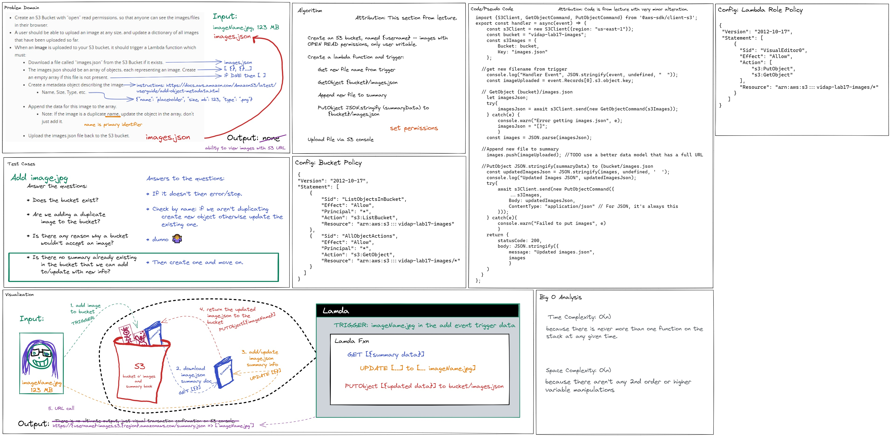

# LAB - Class 17

## Project: S3Lambda

### Author: Vida P.

### Documentation

In your README.md include:

* a description of how to use your lambda.
* a description of any issues you encountered during deployment of this lambda.
* a link to your images.json file

You probably also want 
* a copy of your lambda code - the .js, 
* the package.json, and 
* any policies you created

### Links and Resources

- [ci/cd](https://github.com/Vida-1/S3Lambda/actions/new)
- [back-end server url](http://xyz.com) (when applicable)
- [front-end application](http://xyz.com) (when applicable)
- [Reading Notes 17 -AWS: S3 and Lambda](https://vida-1.github.io/reading-notes/read17_401.html)
- 
### Setup

#### `.env` requirements (where applicable)

i.e.

- `PORT` - Port Number
- `DATABASE_URL` - URL to the running Postgres instance/db

#### How to initialize/run your application (where applicable)

- e.g. `npm start`

#### How to use your lambda

Follow this link: https://vidap-lab17-images.s3.amazonaws.com/images.json

#### Any Issues Encountered
* I got turned around multiple times near the end trying to get this to work. I think it finally di

#### UML

 
* [Snip of images.json](lab17_imagesJson.jpg)
* [Whiteboard_2ndDraft](lab17_2ndDraft_Whiteboard.jpg)
* [Whiteboard_1stDraft](lab17_1stDraft_Whiteboard.jpg)

